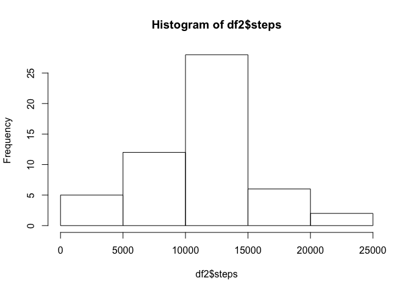
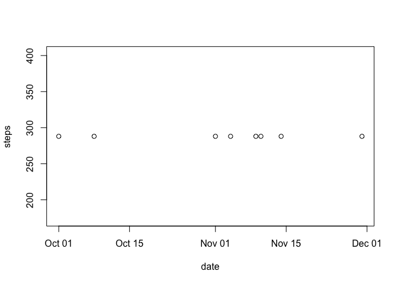
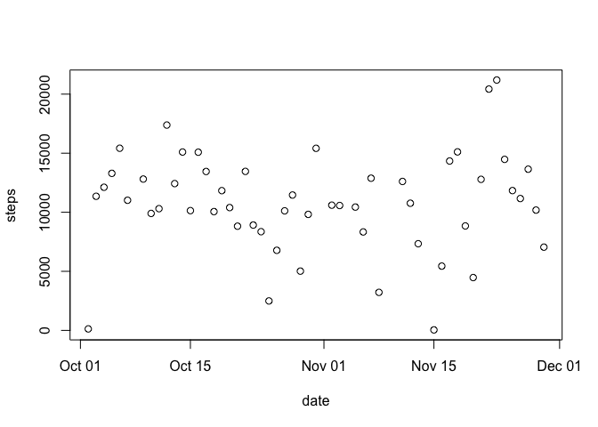
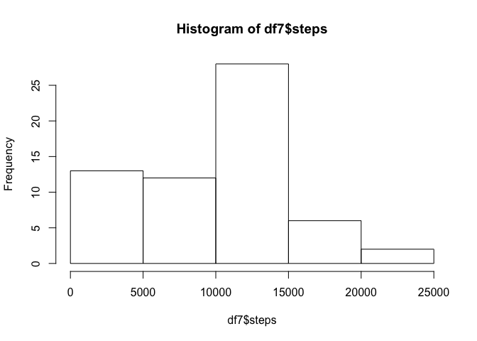
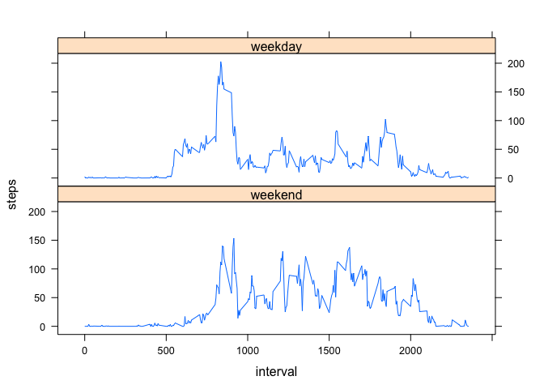

Personal activity monitoring.
-----------------------------

This data set tracks use of a personal activity monitoring device at 5
minute intervals throughout the day. It's taken from an anonymous
individual collected between October and November 2012.

### Reading the data set

    df<-read.csv("activity.csv",stringsAsFactors=FALSE)

### Adding properly formatted date and time vector.

    df$date<-as.Date(df$date,"%Y-%m-%d")
    df$interval<-sprintf("%04d",as.numeric(df$interval))
    df$date2<-strptime(paste(df$date,df$interval,sep=" "),"%Y-%m-%d %H%M")

Total number of steps taken per day
-----------------------------------

    df2<-with(df,aggregate(steps~date,FUN=sum))
    hist(df2$steps)

Mean and median steps taken per day
-----------------------------------

    mean(df2$steps)

    ## [1] 10766.19

    median(df2$steps)

    ## [1] 10765

Average daily activity pattern
------------------------------

    df3<-with(df,aggregate(steps~interval,FUN=mean))
    with(df3,plot(interval,steps,type="l"))

The interval with the maximum number of steps, on average.
----------------------------------------------------------

    df3[which.max(df3$steps),]

    ##     interval    steps
    ## 104     0835 206.1698

IMPUTING MISSING VALUES
=======================

Total number of missing values

    sum(is.na(df$steps))

    ## [1] 2304

13.11% of the intervals are missing values.

There are 8 full days with missing values, more frequently in November
time period.

    df4<-df[is.na(df$steps),]
    df4sum<-aggregate(steps~date,data=df4,function(x) {sum(is.na(x))},na.action=NULL)
    with(df4sum,plot(date,steps))

No clear trend over time

    df5<-with(df,aggregate(steps~date,FUN=sum))
    with(df5,plot(date,steps))

Impute missing data with median of that interval
------------------------------------------------

    df6<-df
    intervalmedians<-aggregate(steps~interval,data=df6,FUN=median)
    df6$steps<-replace(df6$steps,is.na(df6$steps),intervalmedians[grep(df6$interval,intervalmedians$interval),2])

    ## Warning in grep(df6$interval, intervalmedians$interval): argument 'pattern'
    ## has length > 1 and only the first element will be used

Histogram of new dataset with missing values imputed.
=====================================================

    df7<-with(df6,aggregate(steps~date,FUN=sum))
    hist(df7$steps)

 The
0-5000 bin frequency increases with imputed data.

Mean and median adjusts downward.

    mean(df7$steps)

    ## [1] 9354.23

    median(df7$steps)

    ## [1] 10395

Weekdays vs Weekends
--------------------

Creating a factor variable for weekdays
=======================================

    weekdays1<-c('Monday','Tuesday','Wednesday','Thursday','Friday')
    df6$weekday<-factor((weekdays(df6$date) %in% weekdays1),levels=c(FALSE,TRUE),labels=c('weekend','weekday'))

    df6means<-aggregate(steps~interval,data=df6,FUN=mean)
    df6means<-aggregate(steps~interval+weekday,data=df6,FUN=mean)
    df6means$interval<-as.numeric(df6means$interval)

    xyplot(steps~interval|weekday,data=df6means,layout=c(1,2),type="l")

